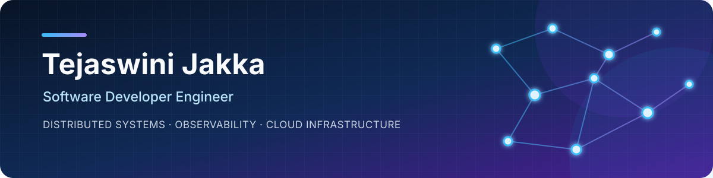

  

  
  
  

## Hi, I'm Tejaswini 👋

I'm a software developer engineer specializing in reliable APIs, distributed systems, platform engineering, and observability tooling. I enjoy turning difficult production problems into measurable improvements - faster queries, safer deployments, clearer telemetry, and systems that recover gracefully when infrastructure fails.

- 🔭 Building telemetry analysis services at **ASU Decision Theater Network**
- ⚙️ Focused on **backend engineering, distributed systems, platform reliability, and observability**
- 🎓 M.S. in Computer Science at **Arizona State University** - GPA: **4.0/4.0**
- 🌎 Based in **Tempe, Arizona**

## Engineering impact

| Challenge | Result |
|---|---|
| High-latency PostgreSQL API queries | Reduced latency by **99%**, from **40 seconds to 20 milliseconds** |
| Slow CI build-metadata retrieval | Cut retrieval time from **20 minutes to under 5 seconds** |
| Platform release consistency | Modernized Kubernetes and Docker delivery across **40+ microservice repositories** |
| High-volume application workflows | Built auditable backend workflows supporting **500+ faculty applications** |

## Technical toolbox

**Languages**

**Platform and backend**

**Observability and delivery**

## What I'm building

### AI-assisted incident orchestration

A distributed diagnostics platform designed for **10,000+ concurrent tasks**, with Docker workers, Redis-backed queues, tool invocation, gRPC heartbeats, failure detection, and automatic job recovery.

### Observability intelligence and capacity forecasting

A forecasting and alert-triage service that turns Prometheus telemetry into **97%-accurate capacity forecasts**, prioritized actions, and Grafana views for proactive reliability planning.

## Selected repositories

| Project | What it demonstrates |
|---|---|
| [True Website Identifier API](https://github.com/tejaswinijakka/True-Website-Identifier-API) | Phishing-URL classification across multiple ML models, reaching **97.4% accuracy** with gradient boosting |
| [Face Mask Detection](https://github.com/tejaswinijakka/Face-Mask-detection) | Computer-vision classification using OpenCV, CNNs, and Python ML tooling |
| [Portfolio Website](https://github.com/tejaswinijakka/tejaswinijakka.github.io) | Responsive personal site built with semantic HTML, modern CSS, and JavaScript |

## Experience

`2025 - Present` **Software Developer** · ASU Decision Theater Network  
`2022 - 2024` **Software Engineer** · F5 Networks  
`2022` **Software Engineer** · Darwinbox  
`2020 - 2021` **Backend Developer** · CBIT Open Source Community

---

  Interested in backend systems, platform engineering, observability, and production reliability? 
  <a href="mailto:tejaswinijakka6@gmail.com"><strong>Let's connect →</strong></a>

